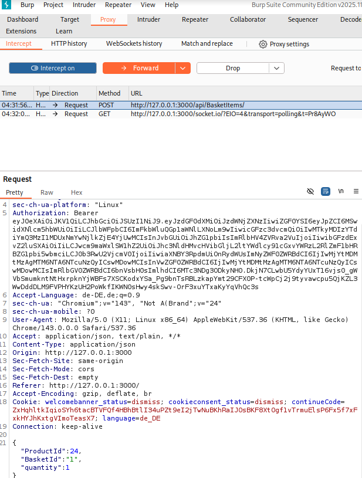
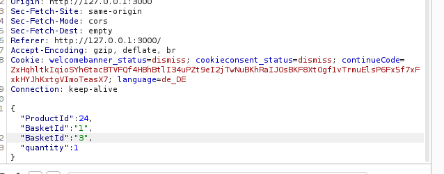

# Broken Access Control — Manipulate Basket

## Overview

This challenge demonstrates how a flawed access control mechanism can be bypassed using HTTP Parameter Pollution. The server validates the user's permission based on the first `BasketId` parameter in the request body, but uses the second one for the actual operation — making it possible to add products to another user's basket.

---

## Table of Contents

- [Video](#video)
- [Category](#category)
- [Difficulty](#difficulty)
- [Goal](#goal)
- [Vulnerability Explanation](#vulnerability-explanation)
- [Prerequisites](#prerequisites)
- [Exploitation Steps](#exploitation-steps)
- [Proof of Concept](#proof-of-concept)
- [Impact](#impact)
- [Mitigation](#mitigation)

---

## Video

A full live demonstration of this challenge — from intercepting the basket request to successfully placing a product in another user's basket via HTTP Parameter Pollution.

> 📹 **[Watch: Broken Access Control — Manipulate Basket · Full Walkthrough](https://somup.com/cOfVQwVcBw5)**

---

## Category

`Broken Access Control`

## Difficulty

`⭐⭐⭐`

---

## Goal

Add a product to another user's basket. The challenge is considered solved when the item has been successfully added to a foreign basket.

---

## Vulnerability Explanation

When a basket request is made, the application checks whether the submitted `BasketId` belongs to the currently logged-in user. However, this check only accesses the **first** `BasketId` entry in the request body.

If two `BasketId` parameters are submitted in the body (**HTTP Parameter Pollution**), the server uses the first one for the security check (own ID → check passes) and the second one for the actual database operation (foreign ID → item ends up in the wrong basket). This inconsistency arises because validation and processing access different parameters.

---

## Prerequisites

The following tools are required to reproduce this challenge:

- **Web Browser** — to interact with the application and navigate the OWASP Juice Shop
- **Burp Suite** — to intercept, inspect, and manipulate HTTP requests

---

## Exploitation Steps

> All steps were performed in an isolated VirtualBox lab environment.

**Step 1 — Observe the basket request**

A product was added to the own basket and the outgoing request was intercepted in Burp Suite. The own `BasketId` was visible in the request body, and the method and structure of the request were clearly identifiable:

```json
{
  "ProductId": 1,
  "BasketId": "6",
  "quantity": 1
}
```



---

**Step 2 — Direct access to a foreign basket (fails)**

As a first attempt, the `BasketId` in the request was directly replaced with another user's ID:

```json
{
  "ProductId": 1,
  "BasketId": "2",
  "quantity": 1
}
```

The server detected the foreign basket and rejected the request with an access error — the access control works correctly in this case.

---

**Step 3 — HTTP Parameter Pollution: duplicate the BasketId**

In the next attempt, the `BasketId` parameter was submitted twice in the request body: first the own ID (for the security check), then the foreign ID (for the actual operation):

```json
{
  "ProductId": 1,
  "BasketId": "6",
  "BasketId": "2",
  "quantity": 1
}
```

The server checked the **first** `BasketId` (`6` — own basket → check passes) and used the **second** `BasketId` (`2` — foreign basket) for the database operation. The product was added to the other user's basket.



---

## Proof of Concept

The challenge was completed successfully. The product was added to another user's basket without knowing their credentials or hijacking their session.


---

## Impact

- **Confidentiality:** An attacker can identify which baskets exist and under which IDs they are accessible.
- **Integrity:** Products can be added to foreign baskets without the owner's knowledge or consent — for example to manipulate orders or cause unwanted charges.
- **Availability:** Not directly affected.
- **Business Risk:** Manipulation of customer data, potential fraudulent orders in the name of other users, loss of trust, legal consequences from unauthorized access to foreign user data.

---

## Mitigation

- **Server-side authorization on every operation:** Not only for reads, but also for writes, the server must verify whether the requested resource belongs to the authenticated user.
- **Accept only one parameter:** The server should reject requests entirely when duplicate parameters are present, rather than silently ignoring one of them.
- **Derive basket ID from the server session:** Instead of accepting the `BasketId` from the client, the server should derive the associated basket ID directly from the authenticated session — making it impossible for an attacker to manipulate it.
- **Penetration testing & BOLA checks:** Broken Object Level Authorization (BOLA) is one of the most common API vulnerabilities and should be explicitly included in the security testing process.

---

*Documented as part of the DevSecOps training — OWASP Juice Shop Challenge*
