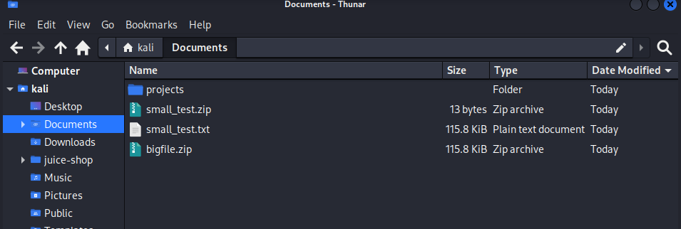
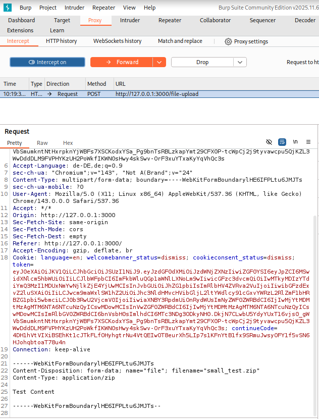

# Improper Input Validation — Upload Size & Upload Type

## Overview

This documentation covers how two related challenges were solved with a single attack: **Upload Size** (uploading a file larger than 100 kB) and **Upload Type** (uploading a file with a disallowed extension). Both validations are only superficially enforced by the application and can be fully bypassed through deliberate manipulation of the HTTP request using Burp Suite.

---

## Table of Contents

- [Video](#video)
- [Category](#category)
- [Difficulty](#difficulty)
- [Goal](#goal)
- [Vulnerability Explanation](#vulnerability-explanation)
- [Prerequisites](#prerequisites)
- [Exploitation Steps](#exploitation-steps)
- [Proof of Concept](#proof-of-concept)
- [Impact](#impact)
- [Mitigation](#mitigation)

---

## Video

A full live demonstration of this challenge — from preparing the test files to bypassing both the upload size and file type restrictions with a single manipulated request.

> 📹 **[Watch: Improper Input Validation — Upload Size & Type · Full Walkthrough](https://go.screenpal.com/watch/cOevIRnTvHO)**

---

## Category

`Improper Input Validation`

## Difficulty

`⭐⭐`

---

## Goal

**Challenge 1 — Upload Size:** Upload a file larger than 100 kB, even though the application restricts uploads to a maximum of 100 kB.

**Challenge 2 — Upload Type:** Upload a file whose extension is neither `.pdf` nor `.zip`, even though the application only permits these two types.

Both challenges are considered solved when the server accepts the manipulated upload and returns a success response.

---

## Vulnerability Explanation

The application does not validate the size of an uploaded file server-side during actual request processing. The check either occurs only in the frontend (JavaScript) or only during the initial request inspection.

An attacker can bypass this control by first uploading a valid, small file and intercepting the outgoing HTTP request using a proxy tool (in this case: Burp Suite). The file content in the request body is then replaced with the content of a larger file — the server accepts the request because it does not re-validate the size during processing.

---

## Prerequisites

The following tools are required to reproduce this challenge:

- **Web Browser** — to interact with the application and access the upload form
- **Burp Suite** — to intercept, inspect, and manipulate the outgoing HTTP upload request

---

## Exploitation Steps

> All steps were performed in an isolated VirtualBox lab environment.

**Step 1 — Preparing the Test Files**

Two files are needed:

- A file **smaller than 100 kB**: A simple `.txt` file with arbitrary text content is sufficient. Since the application only accepts `.pdf` or `.zip`, the file extension is simply renamed to `.zip` (`small_file.zip`).
- A file **larger than 100 kB**: Also a `.txt` file, filled with enough text to exceed 100 kB. This file only serves as a content source — its extension does not matter here.



---

**Step 2 — Intercepting the Upload with Burp Suite**

The upload form is opened in the application. The small file (`small_file.zip`) is selected and the form is filled in. In Burp Suite, **Intercept is on** is enabled under **Proxy → Intercept**. The upload is then submitted via the **Submit** button.

Burp Suite intercepts the outgoing HTTP request. The following relevant details are visible in the request:

- **URL:** `POST /file-upload`
- **Content-Type:** `application/zip` *(inherited from the renamed file extension)*
- **Body:** Contains the file content of the small file



---

**Step 3 — Manipulating the Request & Solving Both Challenges**

Two modifications are made to the intercepted request:

1. **The filename in `Content-Disposition`** is changed from `small_file.zip` back to `small_file.txt` — this bypasses the file type check *(→ solves Challenge: Upload Type)*.
2. **The file content in the body** is completely replaced with the content of the large file (>100 kB) *(→ solves Challenge: Upload Size)*.

The request is then forwarded using **Forward**.

```
# Original body:
Content-Disposition: form-data; name="file"; filename="small_file.zip"
Content-Type: application/zip

[small file content ~1 kB]

# Manipulated body:
Content-Disposition: form-data; name="file"; filename="small_file.txt"
Content-Type: application/zip

[replaced file content >100 kB]
```

The server accepts the request without any objection — neither the file type nor the file size is re-validated server-side. Both challenges are solved simultaneously.

---

## Proof of Concept

The challenge was completed successfully. The server accepted a file larger than 100 kB, even though the application is specifically designed to prevent this. The missing server-side size validation during request processing allowed the bypass.

---

## Impact

- **Confidentiality:** No direct data leakage, however large files can contain sensitive information that is uploaded without any control.
- **Integrity:** An attacker can inject arbitrarily large files into the system, corrupting expected data objects.
- **Availability:** Mass uploads of very large files can exhaust disk space and cause a Denial of Service, crashing the application.
- **Business Risk:** Increased storage costs, system instability, and potential follow-up attacks through injected files (e.g., when large inputs are processed incorrectly).

---

## Mitigation

- **Server-side validation:** File size **must** be validated server-side upon receipt and before processing — client-side checks alone are not a security measure.
- **Validate Content-Length:** Evaluate the `Content-Length` header of the request server-side and immediately reject it with HTTP 413 (Payload Too Large) if the limit is exceeded.
- **Streaming limit:** Cap the incoming request stream at the maximum permitted size so that larger files are never fully received.
- **WAF / Reverse Proxy:** Configure a Web Application Firewall or a reverse proxy (e.g., nginx) to automatically reject requests exceeding a defined size limit.
- **Logging & Monitoring:** Log upload events including file sizes and trigger alerts for unusually large uploads.

---

*Documented as part of the DevSecOps training — OWASP Juice Shop Challenge*
