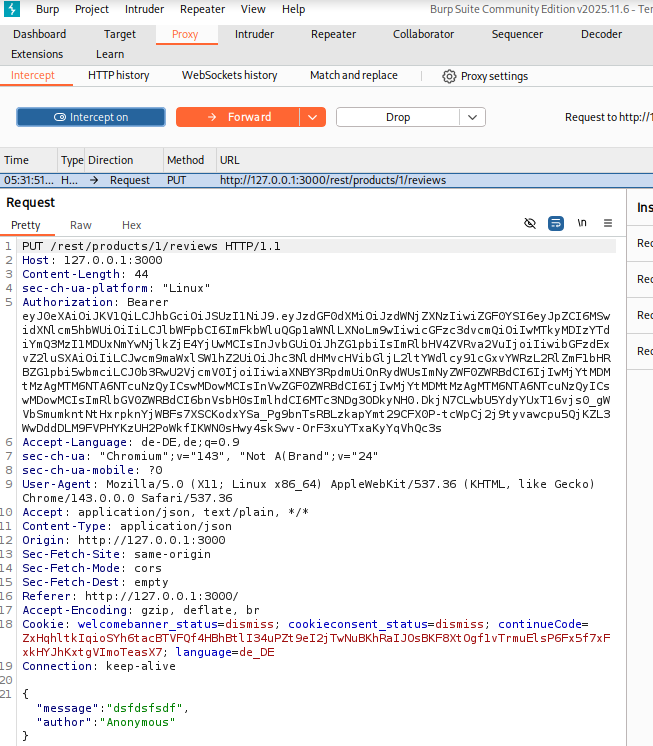
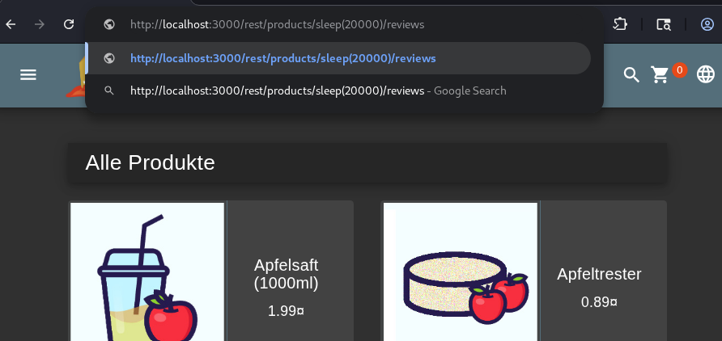

# NoSQL Injection — DoS (Sleep)

## Overview

This challenge demonstrates how missing input validation on a NoSQL database can be exploited to inject a deliberate sleep command into the server, bringing it to a halt for a set period of time — a classic Denial-of-Service through NoSQL Injection.

---

## Table of Contents

- [Video](#video)
- [Category](#category)
- [Difficulty](#difficulty)
- [Goal](#goal)
- [Vulnerability Explanation](#vulnerability-explanation)
- [Prerequisites](#prerequisites)
- [Exploitation Steps](#exploitation-steps)
- [Proof of Concept](#proof-of-concept)
- [Impact](#impact)
- [Mitigation](#mitigation)

---

## Video

A full live demonstration of this challenge — from identifying the attack surface to triggering the DoS via a manipulated URL.

> 📹 **[Watch: NoSQL Injection — DoS (Sleep) · Full Walkthrough](https://somup.com/cOfV6fVcBag)**

---

## Category

`Injection` / `NoSQL Injection`

## Difficulty

`⭐⭐⭐⭐`

---

## Goal

Force the server to sleep for a set period of time by injecting a NoSQL payload. The challenge is considered solved when the server becomes unreachable for a few seconds after sending the manipulated request.

---

## Vulnerability Explanation

The application passes user input unfiltered to a NoSQL database (MongoDB). MongoDB supports JavaScript expressions in certain query operators — including functions like `sleep()`. If such a function is passed as input without being sanitized, the database executes it directly.

This allows an attacker to deliberately block database processing through a manipulated URL or request body, making the server temporarily unreachable for all other users.

---

## Prerequisites

The following tools are required to reproduce this challenge:

- **Web Browser** — to interact with the application and send the manipulated URL
- **Burp Suite** — to intercept and inspect HTTP requests

---

## Exploitation Steps

> All steps were performed in an isolated VirtualBox lab environment.

**Step 1 — Identify the attack surface**

Since this is an injection challenge, a location was sought where user input is passed directly to the database. From previous challenges, it was known that product reviews represent a potential vulnerability.

A product review was submitted and the outgoing request was intercepted in Burp Suite. The following information was visible:

- **Method:** `PUT`
- **Content-Type:** `application/json`
- **URL:** contains a product ID in the path



---

**Step 2 — Payload attempts in the request body**

As a first attempt, a payload was added to the JSON body:

```json
"id": "sleep(10000)"
```

This had no effect — the server processed the request normally.

---

**Step 3 — Inject payload directly into the URL**

In the next step, the full URL was copied and the product ID in the path was replaced with the sleep payload:

```
GET /rest/products/sleep(20000)/reviews
```

This request was sent directly via the browser. The database executed the `sleep(20000)` command — the server was blocked for 20 seconds.



---

## Proof of Concept

To verify the result, the products in the shop were reloaded — the server was no longer reachable. The challenge was thereby completed successfully.

---

## Impact

- **Confidentiality:** Not directly affected, however this vulnerability can be combined with further injection techniques to spy on database queries.
- **Integrity:** Targeted NoSQL injection could be used to manipulate database queries.
- **Availability:** An attacker can deliberately and repeatedly block the server — this constitutes a complete Denial of Service for all users.
- **Business Risk:** Total service outage, reputational damage, loss of user trust, potential SLA violations.

---

## Mitigation

- **Use parameterized queries:** User input must never be embedded directly into database queries. Parameterized queries strictly separate code from data, preventing injected code from being executed.
- **Disable JavaScript execution in MongoDB:** The `--noscripting` option in MongoDB prevents the execution of JavaScript expressions in queries and completely eliminates this attack surface.
- **Validate and sanitize inputs:** All user input must be validated server-side for type, format, and allowed characters before being processed further.
- **Least Privilege:** The application's database user should only have the minimum necessary permissions — in particular no rights to execute system commands.
- **Rate Limiting & Timeouts:** Database queries should be configured with a maximum execution timeout so that a single request cannot permanently block the server.

---

*Documented as part of the DevSecOps training — OWASP Juice Shop Challenge*
