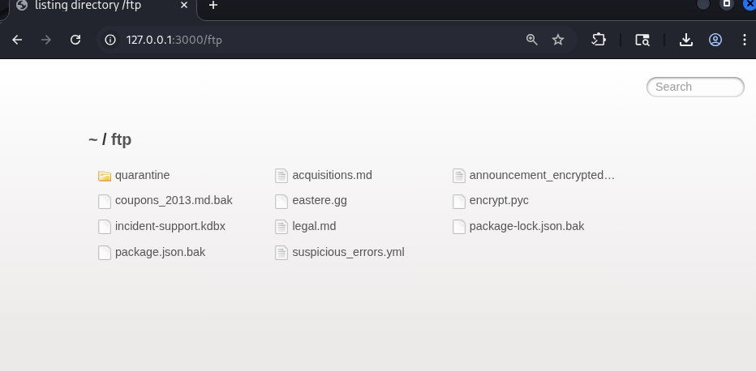
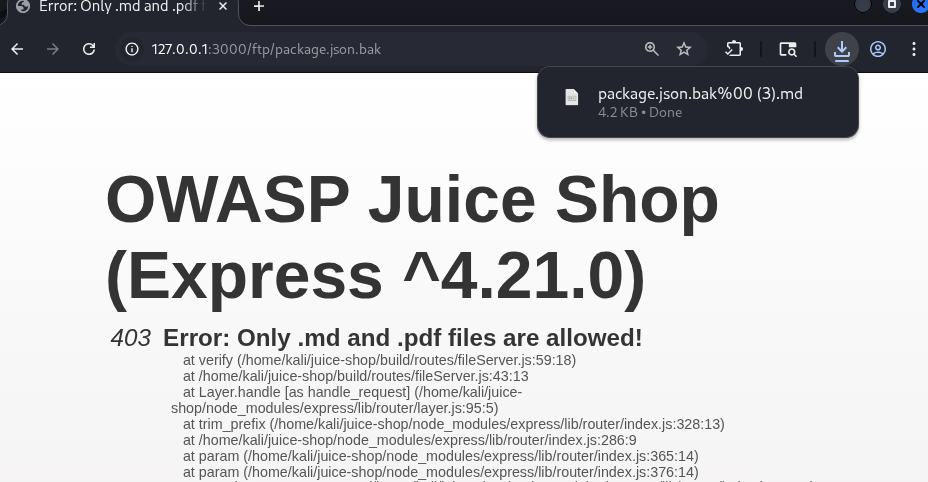

# Sensitive Data Exposure — Forgotten Developer Backup

## Overview

This challenge demonstrates how a forgotten developer backup file can be discovered via a publicly accessible FTP directory and downloaded using a Null-Byte Injection technique — even though the server is supposed to restrict access to it.

---

## Table of Contents

- [Video](#video)
- [Category](#category)
- [Difficulty](#difficulty)
- [Goal](#goal)
- [Vulnerability Explanation](#vulnerability-explanation)
- [Prerequisites](#prerequisites)
- [Exploitation Steps](#exploitation-steps)
- [Proof of Concept](#proof-of-concept)
- [Impact](#impact)
- [Mitigation](#mitigation)

---

## Video

A full live demonstration of this challenge — from discovering the FTP directory to downloading the restricted backup file via Null-Byte Injection.

> 📹 **[Watch: Sensitive Data Exposure — Forgotten Developer Backup · Full Walkthrough](https://somup.com/cOewjvVczzo)**

---

## Category

`Sensitive Data Exposure`

## Difficulty

`⭐⭐⭐⭐`

---

## Goal

Gain access to a forgotten backup copy of a developer file. The challenge is considered solved when the file `package-lock.json.bak` is successfully downloaded.

---

## Vulnerability Explanation

The application hosts a publicly reachable FTP directory at `/ftp`, which contains not only regular files but also a forgotten backup file (`package-lock.json.bak`). The server attempts to restrict access to this file via a file type check — only `.md` and `.pdf` files are permitted.

However, this check is vulnerable to **Null-Byte Injection**: by double URL-encoding a null byte (`%2500`), the server is tricked into believing the request ends with `.md`, while the internal filename processing is terminated at the null byte, causing the server to serve the actual `.bak` file.

---

## Prerequisites

The following tools are required to reproduce this challenge:

- **Web Browser** — to browse the application, navigate the FTP directory, and send the manipulated URL

---

## Exploitation Steps

> All steps were performed in an isolated VirtualBox lab environment.

**Step 1 — Reconnaissance: Discovering the FTP Directory**

While browsing the application, a link to the terms of use was found on the "About Us" page. The URL of that page revealed the following path:

```
http://127.0.0.1:3000/ftp/legal.md
```

This indicated that an `/ftp` directory exists. Navigating to it directly confirmed this and displayed a listing of all files stored there.



---

**Step 2 — Identifying the Target File & Initial Access Attempt**

From the file listing, `package-lock.json.bak` stood out. This file contains all dependencies and versions of the shop project, and the `.bak` extension indicates a forgotten backup copy.

A direct request for the file failed:

```
GET http://127.0.0.1:3000/ftp/package-lock.json.bak

→ 403 Error: Only .md and .pdf files are allowed!
```

The server only allows files with `.md` or `.pdf` extensions.

---

**Step 3 — Null-Byte Injection via Double URL Encoding**

The goal is to manipulate the URL so that the server believes a `.md` file is being requested, without actually looking for that file.

First attempt — appending `.md` directly:

```
GET /ftp/package-lock.json.bak.md

→ 404 Error: ENOENT: no such file or directory
```

The server literally searches for the file `package-lock.json.bak.md`, which does not exist.

Second attempt — inserting a raw null byte (`%00`):

```
GET /ftp/package-lock.json.bak%00.md

→ 400 BadRequestError: Bad Request
```

The server detects the raw `%00` and rejects the request.

Solution — **double URL encoding** of the null byte: The `%` character itself is URL-encoded (`%` → `%25`), turning `%00` into `%2500`. The server first decodes `%25` to `%`, yielding `%00`, then interprets this as the end of the filename and serves the actual `.bak` file:

```
GET /ftp/package-lock.json.bak%2500.md

→ 200 OK — File downloaded successfully ✓
```



---

## Proof of Concept

The challenge was completed successfully. By double URL-encoding the null byte, the server-side file type check was bypassed and the file `package-lock.json.bak` was downloaded.

---

## Impact

- **Confidentiality:** The file `package-lock.json.bak` contains all dependencies and exact version numbers of the libraries in use. An attacker can leverage this information to identify known vulnerabilities in those specific versions.
- **Integrity:** No direct impact, as this was a read-only access.
- **Availability:** Not affected.
- **Business Risk:** Information about the internal technology stack significantly facilitates targeted follow-up attacks. Backup files may also contain credentials, API keys, or other secrets.

---

## Mitigation

- **No backup files in the webroot:** Files with extensions such as `.bak`, `.old`, `.tmp`, or `~` must never be placed in publicly accessible directories.
- **Disable directory listing:** The web server should not expose directory contents to unauthenticated users.
- **Strict file type validation:** File extension checks must not rely solely on string matching — null bytes and other special characters must be sanitized before any validation is performed.
- **Normalize inputs:** URLs and filenames must be fully decoded and normalized before being processed or validated.
- **Least Privilege:** The FTP directory should only contain files that are explicitly intended to be publicly accessible.

---

*Documented as part of the DevSecOps training — OWASP Juice Shop Challenge*
